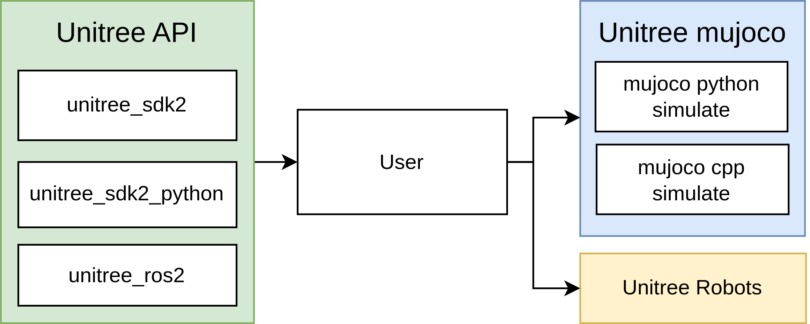

# Introduction
Differences with origin unitree mujoco repo:
* Add foot force sensor
  * c++ simulation
  * python simulation
* Modified keyframe qpos
  * In simulation, use "Load key" button to reload the robot. 
* Add new robot model:
  * Deep Robotics M20 (high resolution!)
  * Unitree A1
  * Unitree Aliengo
  * Unitree Go1
  * Xiaomi Cyberdog
  * Deep Robotics Lite3
  * Deep Robotics X30
  * Anybotics Anymal B
  * Anybotics Anymal C


## Unitree mujoco
`unitree_mujoco` is a simulator developed based on `Unitree sdk2` and `mujoco`. Users can easily integrate the control programs developed with `Unitree_sdk2`, `unitree_ros2`, and `unitree_sdk2_python` into this simulator, enabling a seamless transition from simulation to physical development. The repository includes two versions of the simulator implemented in C++ and Python, with a structure as follows:


## Directory Structure
- `simulate`: Simulator implemented based on unitree_sdk2 and mujoco (C++, recommended)
- `simulate_python`: Simulator implemented based on unitree_sdk2_python and mujoco (Python)
- `unitree_robots`: MJCF description files for robots supported by unitree_sdk2
- `terrain_tool`: Tool for generating terrain in simulation scenarios
- `example`: Example programs

## Supported Unitree sdk2 Messages:
**Current version only supports low-level development, mainly used for sim to real verification of controller**
- `LowCmd`: Motor control commands
- `LowState`: Motor state information
- `SportModeState`: Robot position and velocity data

Note:
1. The numbering of the motors corresponds to the actual robot hardware. Specific details can be found in the [Unitree documentation](https://support.unitree.com/home/zh/developer).
2. In the actual robot hardware, the `SportModeState` message is not readable after the built-in motion control service is turned off. However, the simulator retains this message to allow users to utilize the position and velocity information for analyzing the developed control programs.

## Related links
- [unitree_sdk2](https://github.com/unitreerobotics/unitree_sdk2)
- [unitree_sdk2_python](https://github.com/unitreerobotics/unitree_sdk2_python)
- [unitree_ros2](https://github.com/unitreerobotics/unitree_ros2)
- [Unitree Doc](https://support.unitree.com/home/zh/developer)
- [Mujoco Doc](https://mujoco.readthedocs.io/en/stable/overview.html)

## Message (DDS idl) type description
- Unitree Go2, B2, H1, B2w, Go2w robots use unitree_go idl for low-level communication.
- Unitree G1, H1-2 robot uses unitree_hg idl for low-level communication.


# Installation
## Python Simulator (simulate_python)
### 1. Dependencies
#### unitree_sdk2_python
```bash
cd ~
sudo apt install python3-pip
git clone https://github.com/unitreerobotics/unitree_sdk2_python.git
cd unitree_sdk2_python
pip3 install -e .
```
If you encounter an error during installation:
```bash
Could not locate cyclonedds. Try to set CYCLONEDDS_HOME or CMAKE_PREFIX_PATH
```
Refer to: https://github.com/unitreerobotics/unitree_sdk2_python
#### mujoco-python
```bash
pip3 install mujoco
```

#### joystick
```bash
pip3 install pygame
```

### 2. Run
```bash
cd ./simulate_python
python3 ./unitree_mujoco.py -r go2_z1
```
You should see the mujoco simulator with the Go2-Z1 robot loaded.


